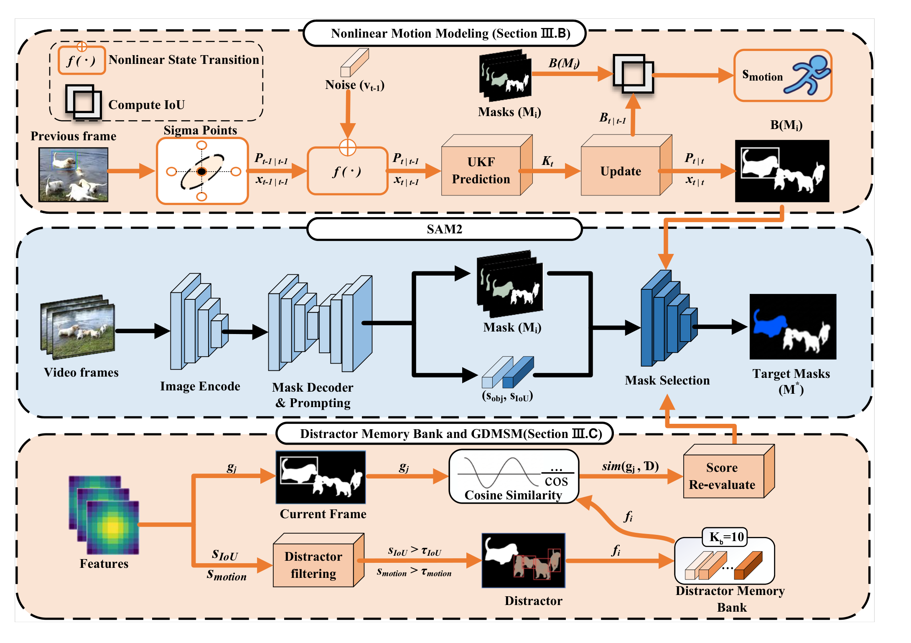
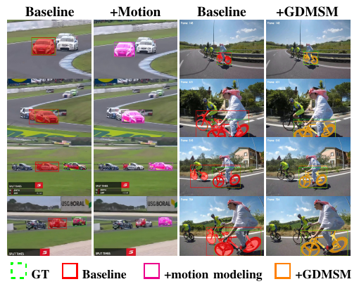
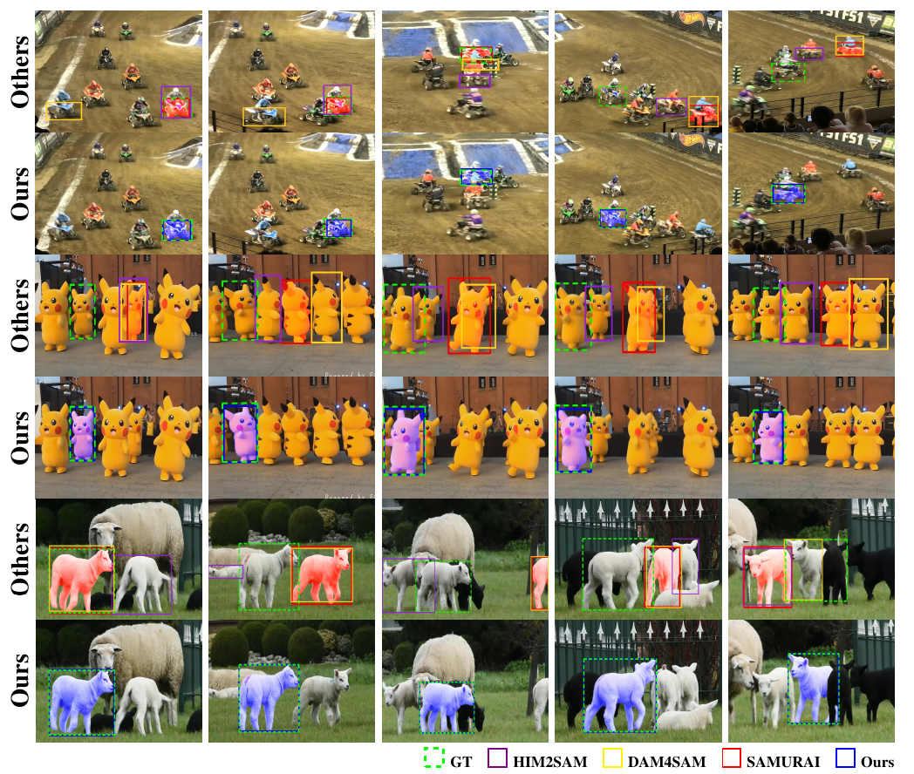

# SAM2USAD

### SAM2-based Unified and Stable Adaptive Zero-shot Visual Object Tracking with Dynamic Consistency

---

<div align="center">
  <a href="#"></a>
  <a href="#"></a>
  <a href="#"></a>
  <a href="#"></a>
</div>

---

<details>
<summary><b>Abstract</b></summary>

Visual object tracking methods built upon SAM2 achieve strong zero-shot performance, yet still degrade under complex nonlinear motion and in the presence of distractors with similar appearance and trajectories. We propose **SAM2USAD**, a unified and stable adaptive zero-shot tracking framework with dynamic consistency. The framework introduces an **Unscented Kalman Filter (UKF)** for nonlinear motion modeling and a **Global Distractor Memory Sign Mechanism (GDMSM)** for high-confidence distractor memorization and suppression. These two components are seamlessly integrated into the frozen pre-trained **SAM2** backbone without retraining or fine-tuning. Experiments show consistent gains across **LaSOT**, **LaSOText**, **GOT-10k**, **VOT-LT2020**, **VOT-LT2022**, and **TrackingNet**, highlighting strong robustness under fast turns, high-speed rotation, occlusion recovery, and similar-trajectory distractor interference.

</details>

---

## Intro

- **SAM2USAD** is a **training-free** and **plug-and-play** zero-shot visual object tracking framework built on top of a frozen **SAM2** backbone.
- It is designed for two hard tracking cases: **complex nonlinear motion** and **similar-trajectory distractors**.
- The method re-ranks SAM2 mask candidates with a **UKF-based nonlinear motion prior** and a **GDMSM-based distractor memory bank**, without any retraining or fine-tuning.

> **README note:** all visual assets below are extracted from the current paper draft for project showcase.  
> When you place this README into a GitHub repository, keep the `assets/` folder in the same directory as `README.md`.
---

## Framework

### Core design
- **Nonlinear motion modeling:** an **Unscented Kalman Filter (UKF)** predicts a more reliable motion prior than simple linear-velocity assumptions.
- **Distractor-aware re-ranking:** **GDMSM** stores high-confidence distractor signatures and suppresses target-like false positives during candidate selection.
- **Training-free integration:** the final target is selected by fusing **motion consistency**, **SAM2 objectness**, and **mask-affinity** scores.

<p align="center">
  
</p>
<p align="center">
  <em><b>Paper Fig. 2.</b> Overall architecture of SAM2USAD. The framework injects UKF-based motion prediction and GDMSM-based distractor suppression into the frozen SAM2 pipeline.</em>
</p>

---

## Quantitative Results

### Headline gains over the SAMURAI baseline
- **LaSOT (Base):** AUC **73.6** vs. **70.7** (**+2.9**)
- **LaSOText (Base):** AUC **61.3** vs. **57.5** (**+3.8**)
- **GOT-10k (Base):** AO **83.3** vs. **79.6** (**+3.7**)
- **VOT-LT2020 (Base):** F-score **67.1** vs. **62.5** (**+4.6**)
- **VOT-LT2022 (Base):** F-score **49.4** vs. **47.5** (**+1.9**)
- **TrackingNet (Base):** **85.9 / 91.1 / 88.5** on **S / NP / P**, compared with **79.3 / 84.9 / 81.2**

### LaSOT / LaSOText / GOT-10k

| Variant | LaSOT (AUC / Pnorm / P) | LaSOText (AUC / Pnorm / P) | GOT-10k (AO / OP0.5 / OP0.75) |
|:--|:--:|:--:|:--:|
| SAM2USAD-T | 71.3 / 78.4 / 75.3 | 58.2 / 69.3 / 66.5 | 81.7 / 90.8 / 75.5 |
| SAM2USAD-S | 71.7 / 79.1 / 77.5 | 61.0 / 73.9 / 70.9 | 82.5 / 91.7 / 77.5 |
| SAM2USAD-B | 73.6 / 81.6 / 79.8 | 61.3 / 74.4 / 68.8 | 83.3 / 93.2 / 78.7 |
| SAM2USAD-L | **75.2 / 83.4 / 81.4** | **64.4 / 78.6 / 74.2** | **85.9 / 94.1 / 80.4** |

### VOT-LT2020 / VOT-LT2022 / TrackingNet (Base backbone)

| Method | VOT-LT2020 (Pr / Re / F) | VOT-LT2022 (Pr / Re / F) | TrackingNet (S / NP / P) |
|:--|:--:|:--:|:--:|
| SAM2.1 | 60.2 / 68.9 / 64.3 | 42.8 / 48.5 / 45.5 | 84.6 / 90.5 / 87.2 |
| SAMURAI | 58.6 / 67.0 / 62.5 | 44.5 / 50.9 / 47.5 | 79.3 / 84.9 / 81.2 |
| DAM4SAM | 60.7 / 69.8 / 64.9 | 43.6 / 49.9 / 46.5 | 84.7 / 90.5 / 86.7 |
| HiM2SAM | 61.2 / 70.3 / 65.4 | 45.0 / 51.3 / 48.0 | 85.4 / 90.8 / 87.3 |
| **SAM2USAD** | **62.5 / 72.4 / 67.1** | **46.2 / 53.1 / 49.4** | **85.9 / 91.1 / 88.5** |

---

## Attribute-wise Robustness

- **LaSOT (Base):** the largest gains come from **Illumination Variation +8.4**, **Camera Motion +5.2**, **Full Occlusion +4.8**, **Fast Motion +4.3**, and **Viewpoint Change +4.3**.
- **LaSOText (Base):** the strongest gains are **OV +5.0**, **ARC +4.9**, **MB +4.1**, **SV +4.1**, **FM +3.2**, and **LR +2.4**.
- These gains are consistent with the paper's motivation: **better nonlinear motion modeling + distractor suppression** improves robustness exactly where SAM2-based trackers are most vulnerable.

---

## Ablation and Parameter Analysis

The two proposed modules are complementary. Each module improves the baseline on its own, and the full model achieves the best result.

| Motion Model | GDMSM | AUC | Pnorm | P |
|:--:|:--:|:--:|:--:|:--:|
| ✗ | ✗ | 70.7 | 78.7 | 76.2 |
| ✗ | ✓ | 72.1 | 79.5 | 78.4 |
| ✓ | ✗ | 72.4 | 80.4 | 78.6 |
| ✓ | ✓ | **73.6** | **81.6** | **79.8** |

<p align="center">
  
</p>
<p align="center">
  <em><b>Paper Fig. 6.</b> Qualitative visualization of module contributions. Both +Motion and +GDMSM reduce drift, while the full design best preserves target consistency in difficult scenarios.</em>
</p>
---

## Qualitative Comparison

<p align="center">
  
</p>
<p align="center">
  <em><b>Paper Fig. 9.</b> Qualitative comparison on long-term challenging sequences. SAM2USAD remains more stable under nonlinear motion, crowded scenes, and similar-trajectory distractors.</em>
</p>

---

## Efficiency

SAM2USAD preserves nearly the same deployment cost as SAMURAI while consistently improving accuracy.

### Memory overhead

| Scale | SAMURAI Act. Mem (GB) | SAM2USAD Act. Mem (GB) | SAMURAI Peak Mem (GB) | SAM2USAD Peak Mem (GB) |
|:--|:--:|:--:|:--:|:--:|
| Tiny | 0.21 | 0.21 (+0.00) | 0.62 | 0.62 (+0.00) |
| Small | 0.20 | 0.22 (+0.02) | 0.66 | 0.67 (+0.01) |
| Base | 0.22 | 0.22 (+0.00) | 0.89 | 0.89 (+0.00) |
| Large | 0.28 | 0.28 (+0.00) | 1.74 | 1.74 (+0.00) |

### Runtime

| Scale | SAMURAI Latency (ms/frame) | SAM2USAD Latency (ms/frame) | SAMURAI FPS | SAM2USAD FPS |
|:--|:--:|:--:|:--:|:--:|
| Tiny | 46.74 | 47.03 (+0.29) | 21.39 | 21.26 (-0.13) |
| Small | 48.12 | 49.52 (+1.40) | 20.78 | 20.19 (-0.59) |
| Base | 52.10 | 52.98 (+0.88) | 19.19 | 18.88 (-0.31) |
| Large | 59.48 | 60.85 (+1.37) | 16.81 | 16.43 (-0.38) |

## Recommended Environment

> The official code is not public yet.  
> The setup below is a practical starter environment based on the **current official SAM2 installation** plus common tracking utilities that are likely to be used in evaluation and visualization scripts.

### Base environment
- **OS:** Ubuntu 20.04 / 22.04 (or **WSL2 + Ubuntu** on Windows)
- **Python:** `>= 3.10`
- **PyTorch:** `>= 2.5.1`
- **TorchVision:** `>= 0.20.1`
- **GPU:** NVIDIA GPU recommended for real-time inference
- **CUDA toolkit:** recommended when compiling the SAM2 CUDA extension

### Setup
```bash
conda create -n sam2usad python=3.10 -y
conda activate sam2usad

# Install PyTorch / TorchVision first according to your CUDA version
# Example:
# pip install torch torchvision --index-url https://download.pytorch.org/whl/cu121

git clone https://github.com/facebookresearch/sam2.git
cd sam2
pip install -e .
pip install -e ".[notebooks]"
cd ..

# Common utilities for evaluation / visualization
pip install opencv-python scipy pandas matplotlib loguru jpeg4py lmdb
```

### Practical notes
- If the **SAM2 CUDA extension** fails to build, the package is still usually usable, although some post-processing functionality may be limited.
- If you are on **Windows**, **WSL + Ubuntu** is the most practical option for a smoother SAM2 installation.
- The exact dependency list may be refined after the public code release.

---

## Planned Release
- [ ] Release code
- [ ] Release checkpoints
- [ ] Release evaluation scripts
- [ ] Release demo / visualization notebooks

---

## Acknowledgement

This work builds on the strong foundation of **SAM2** and is closely related to the recent line of **SAM2-based zero-shot tracking** methods such as **SAMURAI**, **DAM4SAM**, and **HiM2SAM**.

---

## Citation

```bibtex
@article{sam2usad2026,
  title={SAM2USAD: SAM2-based Unified and Stable Adaptive Zero-shot Visual Object Tracking with Dynamic Consistency},
  journal={Draft manuscript},
  year={2026}
}
```
